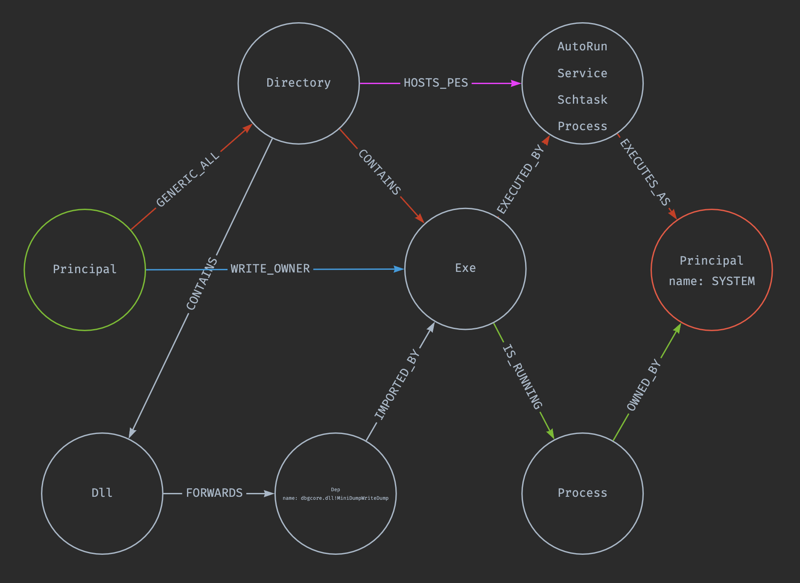

# lpegopher



Collect import/export data from PE files, file-system security descriptors, and automatic file
runners to determine privilege escalation paths and persistence mechanisms via relationship graphs
using Neo4j.

The program has 2 modes:

- collector
- processor

## Collector

_collector code in: ./collectors_

```sh
./lpepgopher collect '<root_dir>'
```

This mode must be run on windows. It collects PEs, their file tree, OS Principals, and Runners.

### Runners

Sources collected for auto-execution

- Services
- Run Keys
- Tasks
- Currently running processes

### PEs, Dirs, and ACLs

Starting at args passed as `<root_dir>`, this will recursively traverse the file tree, collecting
all PE's, their Directories, and all corresponding ACLs for later analysis w/ Neo4j.

## Processor

```sh
Usage: lpegopher process [flags] DIR

Positional arguments:
  DIR                    Directory containing the output csv files

Options:
  --drop                 drop the database before processing [default: false]
  --http <host:port>     serve files to neo4j instead of needing to upload to its /import dir
  --user <user> [default: neo4j, env: NEO_USER]
  --pass <pass> [default: neo4j, env: NEO_PASSWORD]
  --host <host> [default: localhost, env: NEO_HOST]
  --port <port> [default: 7687, env: NEO_PORT]
  --db <dbname> [default: neo4j, env: NEO_DBNAME]
  --proto <proto> [default: bolt, env: NEO_PROTO]
```

The processor seeds neo4j then runs post-processing queries against the data to link it all
together. There are two options to getting the data into neo4j.

1. Upload the collected CSV files to the `import` directory on the neo4j instance and run the
   processing command
2. Use the `--http` flag to start a file server on IP:PORT. Instead of instructing neo4j to seed
   from the server's local `import` directory, neo4j will be pointed to the http server and process
   the files from there.

In either case, the database connection details must be configured, either with CLI flags of ENV
variables. See the usage instructions for variable names.
